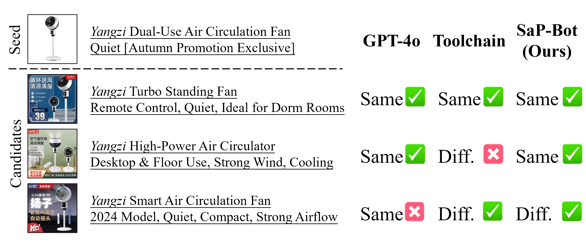
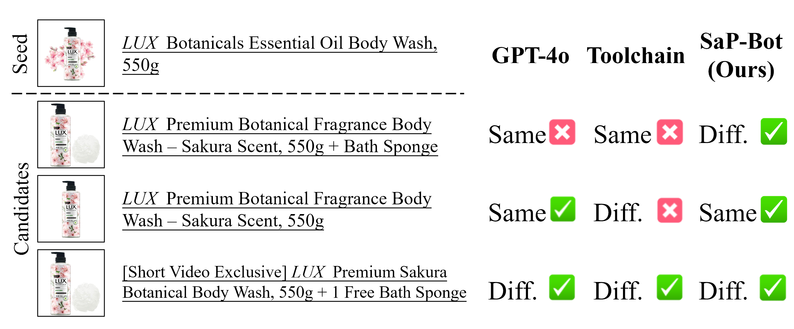
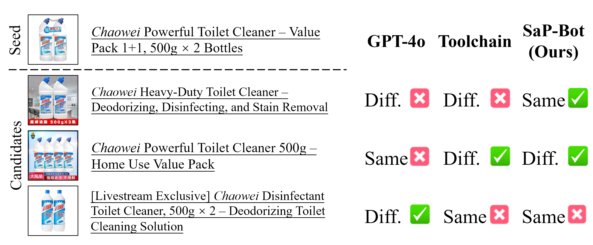
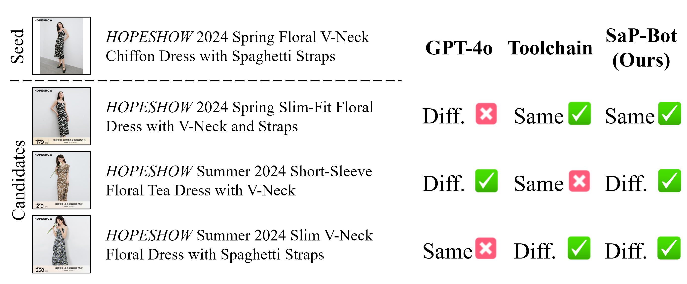
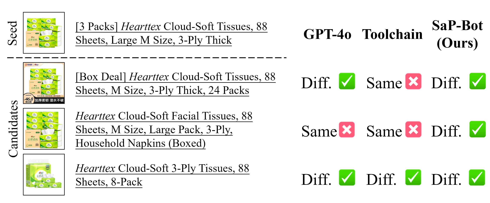
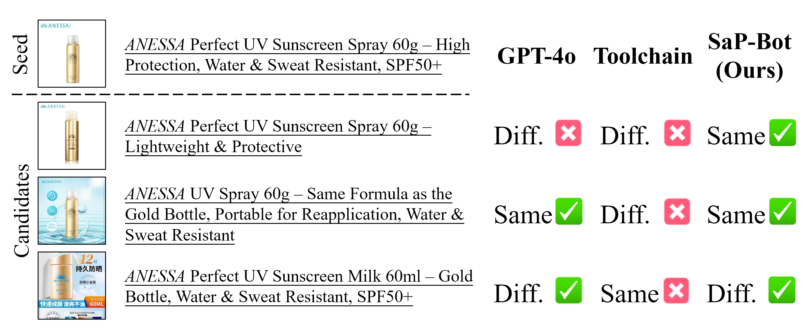
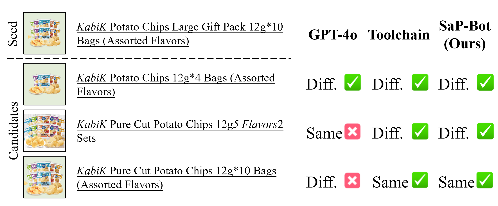

# SaP-Bot
Official codebase for **"SaP-Bot: A Multimodal Large-Language Model for End-to-End Same-Product Identification"**

---

## 🧠 Abstract

Same-product identification serves as a critical infrastructure in e-commerce systems, enabling accurate product matching across heterogeneous marketing representations for key applications such as price comparison and personalized recommendation.
Conventional approaches typically depend on manual feature engineering and extensive rule tuning, which limits their adaptability to varying identification criteria across different product categories and inconsistent business scenarios.  
To overcome these challenges, we propose an end-to-end same-product identification model powered by multimodal large language models (MLLMs) that inherently support multimodal alignment and exhibit strong generalization across diverse real-world settings.  
We first introduce a novel group-wise annotation pipeline to construct a high-quality dataset, consisting of diverse product pairs with multimodal presentations and labeled at the SKU level.  
Building on this dataset, we incorporate task-specific training recipes from the perspective of data augmentation and model robustness, resulting in our **SaP-Bot**, which demonstrates advanced performance and generalization capabilities.  
Moreover, we identify a strong correlation between the output logits of MLLMs with the product similarity, enabling interpretable confidence estimation that benefits both data annotation and downstream applications.

---

## 📦 Data Construction Pipeline

---

## 📊 Comparison with Existing Methods

---

## 🧪 Qualitative Comparison Results

| Category       | Visualization |
|----------------|---------------|
| Alcohol        |  |
| Appliances     |  |
| Bath & Body    |  |
| Cleaning       |  |
| Clothing       |  |
| Jewelry        |  |
| Laundry        |  |
| Paper & Wipe   |  |
| Skincare       |  |
| Snacks         |  |

